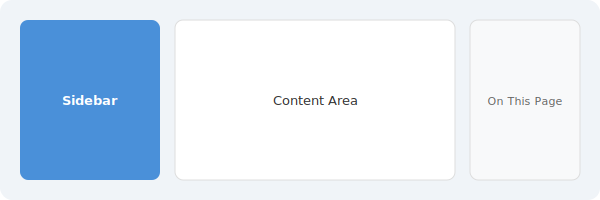

# Getting Started

This section covers how to install and configure JetPage.

## Overview



JetPage presents your documentation in a clean 3-column layout: navigation sidebar on the left, content in the centre, and an "On This Page" TOC panel on the right.

## Prerequisites

- Python 3.12
- [uv](https://docs.astral.sh/uv/)
- Podman (for container-based deployment)

## Installation

Clone the repository and install dependencies:

```bash
git clone https://github.com/your-org/jetpage.git
cd jetpage
uv sync
```

## Running Locally

```bash
uv run python -m jetpage.main
```

Then open your browser at `http://localhost:8080`.
